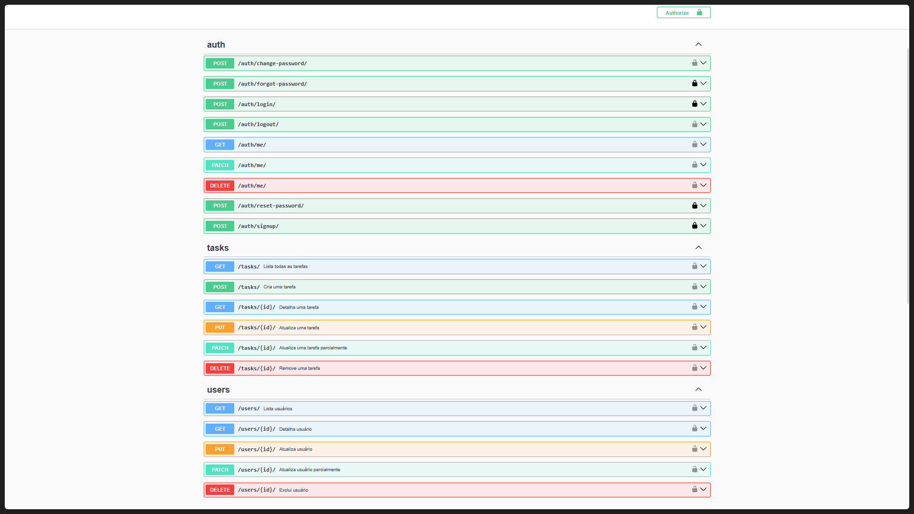
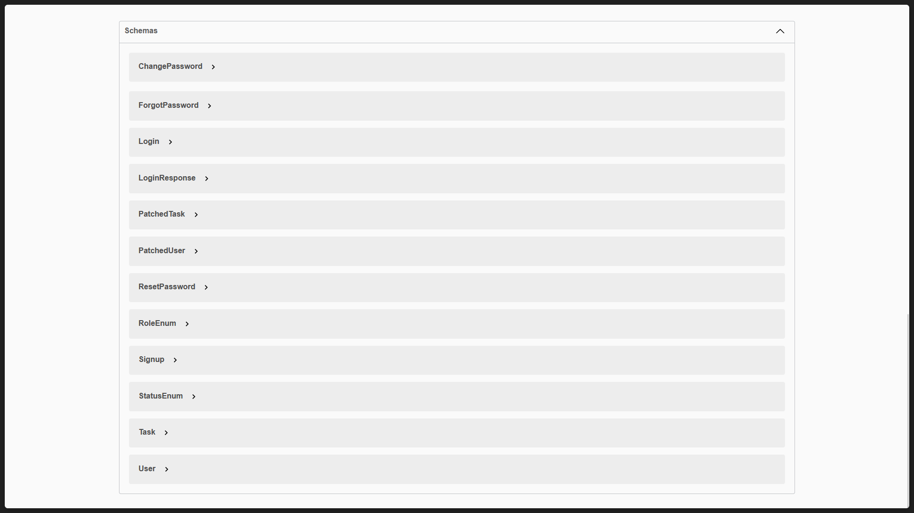
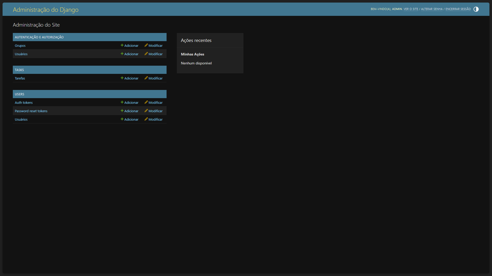
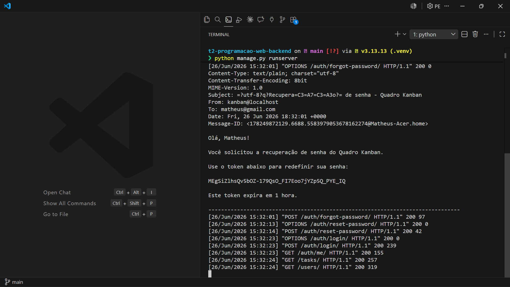

# Quadro Kanban — Backend

Backend do sistema **Quadro Kanban**, desenvolvido para a disciplina de Programação Web.

O frontend do projeto está disponível [aqui](https://github.com/mfigueireddo/t2-programacao-web-frontend).

## Integrantes

* Luana Nobre (2310204)
* Matheus Figueiredo (2320813)

---

## Como rodar o backend localmente

### TL-DR

Windows
```bash
python -m venv .venv
.venv\Scripts\activate
pip install -r requirements.txt
python manage.py migrate
python manage.py runserver
```

Linux/Mac
```bash
python3 -m venv .venv
source .venv/bin/activate
pip install -r requirements.txt
python manage.py migrate
python manage.py runserver
```

### 1. Entrar na pasta do backend

```bash
cd t2-programacao-web-backend
```

### 2. Criar e ativar ambiente virtual

No Windows:

```bash
python -m venv .venv
.venv\Scripts\activate
```

No Linux/Mac:

```bash
python3 -m venv .venv
source .venv/bin/activate
```

### 3. Instalar dependências

```bash
pip install -r requirements.txt
```

### 4. Rodar as migrações

```bash
python manage.py migrate
```

### 5. Rodar o servidor

```bash
python manage.py runserver
```

A API ficará disponível em:

```text
http://127.0.0.1:8000/
```

### [OPCIONAL] Criar superusuário

```bash
python manage.py createsuperuser
```

## Swagger

A documentação da API está disponível em:

```text
http://127.0.0.1:8000/swagger/
```

---

## Funcionalidades implementadas

* Cadastro de usuários
* Login com nome e senha
* Autenticação por token
* Logout
* Consulta do usuário logado
* Edição de perfil
* Exclusão da própria conta
* Troca de senha
* Recuperação de senha por token
* CRUD de tarefas
* Controle de permissões para administrador e usuário comum
* Proteção dos endpoints de tarefas
* Documentação da API com Swagger

---

## Regras de permissão

O sistema possui dois tipos de usuário:

### Administrador

O administrador pode:

* visualizar todas as tarefas;
* criar tarefas;
* editar todos os campos de uma tarefa;
* remover tarefas;
* acessar a lista de usuários;
* editar seu próprio perfil;
* excluir qualquer conta de usuário (inclusive a sua).

### Usuário comum

O usuário comum pode:

* visualizar as tarefas;
* alterar o status de tarefas quando for responsável;
* editar o próprio perfil;
* trocar sua senha;
* excluir a própria conta.

O usuário comum não pode:

* criar tarefas;
* remover tarefas;
* alterar livremente todos os campos de uma tarefa.

---

## Modelos principais

### Usuário

Campos principais:

* `name`: nome único do usuário;
* `password`: senha armazenada com hash;
* `role`: permissão do usuário, podendo ser `ADMINISTRADOR` ou `USUARIO`;
* `created_at`: data de criação do usuário.

### Tarefa

Campos principais:

* `name`: nome da tarefa;
* `status`: status da tarefa;
* `description`: descrição da tarefa;
* `story_points`: estimativa de esforço;
* `due_date`: data limite;
* `closed_at`: data de fechamento;
* `creator`: usuário criador da tarefa;
* `responsible`: usuário responsável pela tarefa.

## Status das tarefas

Os status utilizados no backend são:

* `A_FAZER`
* `EM_PROGRESSO`
* `PRONTO`
* `ENTREGUE`

No frontend, esses status são exibidos como:

* A Fazer
* Em Progresso
* Pronto
* Entregue

---

## Principais endpoints

### Autenticação

| Método | Rota                     | Descrição                          |
| ------ | ------------------------ | ---------------------------------- |
| POST   | `/auth/signup/`          | Cadastra novo usuário              |
| POST   | `/auth/login/`           | Faz login                          |
| POST   | `/auth/logout/`          | Faz logout                         |
| GET    | `/auth/me/`              | Retorna o usuário logado           |
| PATCH  | `/auth/me/`              | Atualiza dados do usuário logado   |
| DELETE | `/auth/me/`              | Exclui a conta do usuário logado   |
| POST   | `/auth/change-password/` | Troca a senha do usuário logado    |
| POST   | `/auth/forgot-password/` | Gera token de recuperação de senha |
| POST   | `/auth/reset-password/`  | Redefine senha usando token        |

### Usuários

| Método | Rota          | Descrição                     |
| ------ | ------------- | ----------------------------- |
| GET    | `/users/`     | Lista usuários                |
| GET    | `/users/:id/` | Detalha um usuário            |
| PATCH  | `/users/:id/` | Atualiza usuário parcialmente |
| DELETE | `/users/:id/` | Exclui usuário                |

### Tarefas

| Método | Rota          | Descrição                    |
| ------ | ------------- | ---------------------------- |
| GET    | `/tasks/`     | Lista tarefas                |
| POST   | `/tasks/`     | Cria tarefa                  |
| GET    | `/tasks/:id/` | Detalha tarefa               |
| PUT    | `/tasks/:id/` | Atualiza tarefa              |
| PATCH  | `/tasks/:id/` | Atualiza tarefa parcialmente |
| DELETE | `/tasks/:id/` | Remove tarefa                |

---

## Recuperação de senha

A recuperação de senha foi implementada por meio de um token gerado pelo backend e enviado ao email do usuário.

Para fins acadêmicos e de demonstração, o email é entregue pelo console backend do Django, de modo que o token aparece no terminal do backend.


## O que funciona e o que não funciona

Dado o que foi proposto, tudo foi testado e funciona. A única limitação a se pontuar é que a recuperação de senha via e-mail é apenas exibida no terminal da aplicação, em vez de ser enviada por e-mail de fato.

---

### Algumas imagens da versão final do projeto







